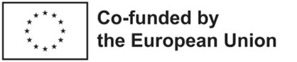

(credits)=
# Credits and License
### How to Cite This Book
You can refer to this book as:  

**Cupać, J., Louter, C., Nikolov, G., Schuster, M., Datsiou, K. C. (2025). _Open GLASSlab – Interactive Strength Analysis Handbook_.**  
<[https://oit.tudelft.nl/open-GLASSlab/](<https://oit.tudelft.nl/open-GLASSlab/>)>.Source files at [https://github.com/TUDelft-books/open-GLASSlab](<https://github.com/TUDelft-books/open-GLASSlab>)  

### Referencing Individual Chapters or Pages

You can refer to individual chapters or pages within this book as:

<**Title of Chapter or Page**>**. In Cupać, J., Louter, C., Nikolov, G., Schuster, M., Datsiou, K. C. (2025). _Open GLASSlab TeachBook_.**  
[Specific Page on https://oit.tudelft.nl/open-GLASSlab/](<https://oit.tudelft.nl/open-GLASSlab/>)

## Content Updates and Versioning

We anticipate that the content of this book will change significantly. Therefore, we recommend using the source code directly with the citation above that refers to the GitHub repository and lists the date and name of the file. Although content will be added over time, **chapter titles and URLs in this book are expected to remain relatively static**. However, we make no guarantee, so if it is important for you to reference a specific location/commit within the book.

## How the Book Is Made

This book is created using **open-source tools**:  

- It is a **JupyterBook**, written using **Markdown** and **Jupyter notebooks**.  
- Additional tooling is used from the **TeachBooks initiative** to enhance the editing and reading experience.  
- The website can be viewed at **[https://oit.tudelft.nl/open-GLASSlab/](<https://oit.tudelft.nl/open-GLASSlab/>)**.  
- The files are stored in a   

For further information, please refer to the repository's **README file** or contact the authors.  

## About the Editors
This book is edited by [**Jagoda Cupać1**](https://www.linkedin.com/in/jagoda-cupac/), [**Christian Louter1**](https://www.linkedin.com/in/christianlouter/), [**Miriam Schuster2**](https://www.linkedin.com/in/miriamschuster/), and [**Kyriaki Corinna Datsiou3**](https://www.linkedin.com/in/kyriaki-corinna-datsiou-b4340346/).  
The Python scripts for **three Methods** have been created by [**Georgi Nikolov1**](https://www.linkedin.com/in/georgi-dimitrov-nikolov/). 

1 Department of Materials, Mechanics, Management & Design (3MD), Faculty of Civil Engineering and Geosciences, Delft University of Technology  

2 Institute of Structural Mechanics and Design, Department of Civil and Environmental Engineering, Technische Universität Darmstadt  

3 Centre for Engineering Research, School of Physics, Engineering and Computer Science, University of Hertfordshire  

## Funding Disclaimer

Open GLASSlab has been created as part of the Open Education project Open GLASSroom.  

The creation of these resources has been (partially) funded by the ERASMUS+ grant program of the European Union under grant no. 2022-1-DE01-KA220-HED-000089750. Neither the European Commission nor the project’s national funding agency DAAD are responsible for the content or liable for any losses or damage resulting from the use of these resources.

  

## License  

This TeachBook is licensed under **CC BY 4.0**, allowing you to **share and adapt** the material, as long as the source is properly credited.  
